```mermaid
%%{init: {'theme':'base', 'themeVariables': {'primaryColor':'#fff','fontSize':'15px'}}}%%
graph LR
    %% Row 1: Authentication & Entry (Steps 1-4)
    A["<b>1. User Submit</b><br/>Next.js + Amplify"]:::auth
    B["<b>2. Cognito Auth</b><br/>JWT Tokens"]:::auth
    C["<b>3. API Gateway</b><br/>Token Validation"]:::auth
    D["<b>4. Lambda</b><br/>user_id extract"]:::compute
    
    %% Row 1: Agentic & RAG (Steps 5-6)
    E["<b>5. Strands Agent</b><br/>Reason/Plan/Act"]:::compute
    F["<b>6. Bedrock RAG</b><br/>Brand Context"]:::ai
    
    %% Turn Point
    G["<b>7. Claude 3.5</b><br/>Hinglish Copy"]:::ai
    
    %% Row 2: AI Processing (Steps 8-9)
    H["<b>8. Guardrails</b><br/>PII Redaction"]:::ai
    I["<b>9. Titan Gen</b><br/>1024x1024 Image"]:::ai
    
    %% Row 2: Storage & Delivery (Steps 10-12)
    J["<b>10. S3 Storage</b><br/>Pre-signed URLs"]:::storage
    K["<b>11. DynamoDB</b><br/>User-isolated"]:::storage
    L["<b>12. Delivery</b><br/>Campaign Ready"]:::storage
    
    %% Flow
    A-->B-->C-->D-->E-->F
    F-->G
    G-->H-->I-->J-->K-->L
    
    %% AWS Official Colors with High Contrast
    classDef auth fill:#DD344C,stroke:#8B0000,stroke-width:4px,color:#fff,font-size:14px
    classDef compute fill:#FF9900,stroke:#CC7A00,stroke-width:4px,color:#000,font-size:14px
    classDef ai fill:#527FFF,stroke:#0000CD,stroke-width:4px,color:#fff,font-size:14px
    classDef storage fill:#569A31,stroke:#2F4F2F,stroke-width:4px,color:#fff,font-size:14px
```

# 🎯 PPT Architecture Diagram - Implementation Guide

**Date:** 2026-02-14  
**Purpose:** Slide 7 - System Architecture  
**Team:** NEONX  
**Aspect Ratio:** 16:9 (PowerPoint Standard)

---

## 🎨 RECOMMENDED DIAGRAM (Copy This)



---

## 📐 Layout Explanation

### Zig-Zag Flow Pattern

```
Row 1 (Left → Right):
[1] → [2] → [3] → [4] → [5] → [6]
                                 ↓
Row 2 (Right ← Left):            [7]
[12] ← [11] ← [10] ← [9] ← [8] ←
```

### Why Zig-Zag?
1. **Compact:** Fits 16:9 aspect ratio perfectly
2. **Readable:** All text visible without clipping
3. **Professional:** Industry-standard flow pattern
4. **Engaging:** Visual interest with the turn

---

## 🎨 Color Coding

### Phase 1: Authentication (Red #DD344C)
**Steps:** 1-3  
**Services:** Next.js, Cognito, API Gateway  
**Purpose:** Security & Identity Layer

### Phase 2: Compute (Orange #FF9900)
**Steps:** 4-5  
**Services:** Lambda, Strands SDK  
**Purpose:** Orchestration & Reasoning

### Phase 3: AI Intelligence (Blue #527FFF)
**Steps:** 6-9  
**Services:** Bedrock (RAG, Claude, Guardrails, Titan)  
**Purpose:** Content Generation & Safety

### Phase 4: Storage & Delivery (Green #569A31)
**Steps:** 10-12  
**Services:** S3, DynamoDB, Frontend  
**Purpose:** Persistence & Distribution

---

## 💻 How to Use in PowerPoint

### Method 1: Export as PNG (Recommended)

#### Step 1: Install Mermaid CLI
```bash
npm install -g @mermaid-js/mermaid-cli
```

#### Step 2: Export Diagram
```bash
# Navigate to project folder
cd Prachar.ai

# Export as PNG (1920x1080 for Full HD)
mmdc -i PPT_ARCHITECTURE_DIAGRAM.md -o slide7-architecture.png -w 1920 -H 1080 -b transparent

# Or export as SVG (scalable)
mmdc -i PPT_ARCHITECTURE_DIAGRAM.md -o slide7-architecture.svg
```

#### Step 3: Insert in PowerPoint
1. Open PowerPoint
2. Go to Slide 7
3. Insert → Picture → slide7-architecture.png
4. Resize to 90% of slide width
5. Center on slide

---

### Method 2: Use Online Tool (No Installation)

#### Step 1: Copy Mermaid Code
- Copy the recommended diagram code above

#### Step 2: Generate Online
1. Visit: https://mermaid.live/
2. Paste the Mermaid code
3. Click "Download PNG" or "Download SVG"
4. Save as `slide7-architecture.png`

#### Step 3: Insert in PowerPoint
- Same as Method 1, Step 3

---

### Method 3: Use PowerPoint Add-in

#### Step 1: Install Mermaid Add-in
1. PowerPoint → Insert → Get Add-ins
2. Search "Mermaid"
3. Install "Mermaid Chart"

#### Step 2: Insert Diagram
1. Insert → Mermaid Chart
2. Paste the Mermaid code
3. Click "Insert"
4. Resize and position

---

## 🎯 Slide 7 Layout

### Slide Title
```
12-Step Autonomous Execution Path
```

### Subtitle
```
7 AWS Services Orchestrated Seamlessly
```

### Diagram Position
- **Center:** Horizontally and vertically centered
- **Size:** 85-90% of slide width
- **Margins:** 5-10% on all sides

### Footer
```
Team NEONX | Prachar.ai | Live Demo: prachar-ai-eta.vercel.app
```

---

## 📊 Slide 7 Complete Layout

```
┌─────────────────────────────────────────────────────────────┐
│                                                             │
│  12-Step Autonomous Execution Path                         │
│  7 AWS Services Orchestrated Seamlessly                    │
│                                                             │
│  ┌───────────────────────────────────────────────────┐    │
│  │                                                     │    │
│  │  [Mermaid Diagram - Zig-Zag Flow]                 │    │
│  │                                                     │    │
│  │  Row 1: [1]→[2]→[3]→[4]→[5]→[6]                  │    │
│  │                              ↓                      │    │
│  │  Row 2: [12]←[11]←[10]←[9]←[8]←[7]               │    │
│  │                                                     │    │
│  └───────────────────────────────────────────────────┘    │
│                                                             │
│  Team NEONX | prachar-ai-eta.vercel.app                   │
│                                                             │
└─────────────────────────────────────────────────────────────┘
```

---

## 🎤 Talking Points for Slide 7

### Opening (5 seconds)
> "Our architecture follows a 12-step autonomous execution path across 7 AWS services."

### Row 1 Explanation (10 seconds)
> "Starting from the top left, we have secure authentication with Cognito, followed by Lambda orchestration and our Strands agent that autonomously reasons and plans."

### The Turn (5 seconds)
> "Notice the flow turns here at step 6, where we retrieve brand context via RAG."

### Row 2 Explanation (10 seconds)
> "Then we move to content generation with Claude 3.5, apply safety guardrails, generate images with Titan, store everything in S3 and DynamoDB, and deliver the complete campaign."

### Closing (5 seconds)
> "All of this happens autonomously in under 60 seconds, with complete user isolation and security."

**Total Time:** 35 seconds

---

## 🎨 Design Variations

### Variation 1: Compact (For Dense Slides)
- **Font Size:** 13px
- **Node Spacing:** 80px
- **Stroke Width:** 3px
- **Best For:** Slides with additional content

### Variation 2: Standard (Recommended)
- **Font Size:** 15px
- **Node Spacing:** 100px
- **Stroke Width:** 4px
- **Best For:** Architecture-focused slides

### Variation 3: Large (For Big Screens)
- **Font Size:** 18px
- **Node Spacing:** 120px
- **Stroke Width:** 5px
- **Best For:** Conference presentations

---

## 🔧 Troubleshooting

### Issue 1: Text Clipping
**Problem:** Long text like "Titan Image Generator" gets cut off  
**Solution:** Increase node padding in init config
```mermaid
%%{init: {'themeVariables': {'nodePadding': 25}}}%%
```

### Issue 2: Arrows Overlapping
**Problem:** Arrows cross over nodes  
**Solution:** Adjust node spacing
```mermaid
%%{init: {'themeVariables': {'nodeSpacing': 120}}}%%
```

### Issue 3: Colors Not Showing
**Problem:** AWS colors not applied  
**Solution:** Ensure classDef is after all nodes
```mermaid
classDef auth fill:#DD344C,stroke:#8B0000,stroke-width:4px,color:#fff
class A,B,C auth
```

### Issue 4: Diagram Too Small
**Problem:** Diagram doesn't fill slide  
**Solution:** Export at higher resolution
```bash
mmdc -i diagram.md -o output.png -w 2400 -H 1350
```

---

## 📏 Dimension Guidelines

### For 16:9 Slides (Standard)
- **Full HD:** 1920x1080 (recommended)
- **HD:** 1280x720
- **4K:** 3840x2160 (for large screens)

### For 4:3 Slides (Legacy)
- **Standard:** 1024x768
- **XGA:** 1024x768
- **SXGA:** 1280x1024

### Export Settings
```bash
# Full HD (recommended)
mmdc -i diagram.md -o output.png -w 1920 -H 1080

# 4K (for large screens)
mmdc -i diagram.md -o output.png -w 3840 -H 2160

# With transparent background
mmdc -i diagram.md -o output.png -w 1920 -H 1080 -b transparent
```

---

## 🎯 Best Practices

### 1. Consistency
- Use same colors across all slides
- Maintain font sizes
- Keep spacing uniform

### 2. Readability
- Minimum font size: 14px
- High contrast colors
- Bold text for emphasis

### 3. Professional Appearance
- AWS official colors
- Clean layout
- Proper alignment

### 4. Accessibility
- High contrast (4.5:1 minimum)
- Clear labels
- Readable fonts

---

## 📊 Comparison with README Diagram

### README Version (Vertical)
- **Layout:** Top-down with subgraphs
- **Phases:** Clearly separated
- **Best For:** Documentation, GitHub
- **Aspect Ratio:** Vertical (not ideal for PPT)

### PPT Version (Zig-Zag)
- **Layout:** Horizontal zig-zag
- **Phases:** Color-coded
- **Best For:** Presentations, slides
- **Aspect Ratio:** 16:9 (perfect for PPT)

---

## ✅ Pre-Presentation Checklist

### Before the Demo
- [ ] Export diagram as PNG (1920x1080)
- [ ] Insert in Slide 7
- [ ] Center and resize to 90% width
- [ ] Test on projector (colors visible?)
- [ ] Practice talking points (35 seconds)
- [ ] Backup: Have PDF version ready

### During the Demo
- [ ] Advance to Slide 7
- [ ] Point to Row 1 (authentication)
- [ ] Point to The Turn (RAG)
- [ ] Point to Row 2 (generation)
- [ ] Emphasize 12 steps, 7 services
- [ ] Mention autonomous execution

---

## 🏆 Final Status

**Diagram Type:** ✅ Zig-Zag Flow  
**Aspect Ratio:** ✅ 16:9 Optimized  
**AWS Colors:** ✅ Official  
**Text Visibility:** ✅ High Contrast  
**Node Spacing:** ✅ Extreme (no clipping)  
**PPT Ready:** ✅ YES  
**Export Options:** ✅ PNG/SVG/PDF  

---

## 📞 Quick Reference

### File Locations
- **Mermaid Code:** `PPT_ARCHITECTURE_DIAGRAM.md`
- **This Guide:** `Updation_Docs/PPT_DIAGRAM_GUIDE.md`
- **README Diagram:** `README.md` (lines 58-120)

### Export Command
```bash
mmdc -i PPT_ARCHITECTURE_DIAGRAM.md -o slide7.png -w 1920 -H 1080 -b transparent
```

### Online Tool
https://mermaid.live/

---

**Your Slide 7 is ready for a winning presentation!** 🎊
